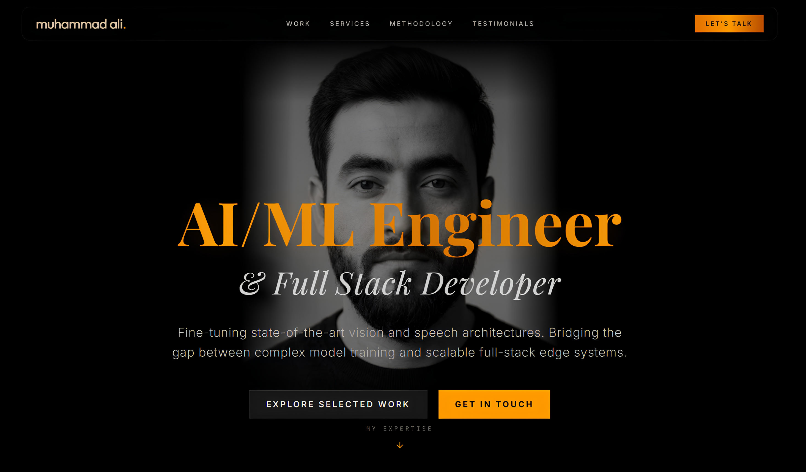

<div align="center">
  
</div>

<br>

<div align="center">
  
</div>

<p align="center">
  <strong>Research-grade machine learning • Edge-optimized architectures • Privacy-first engineering</strong>
</p>

<p align="center">
  <a href="https://www.mohdali.me/" target="_blank">
    
  </a>
</p>

<p align="center">
  
  
  
  
  
  
</p>

---

## 🎯 Featured Projects

### 🎙️ BaltiVoice — Speech AI for Under-Resourced Dialects
```yaml
Problem: Transcribing Balti dialects without cloud dependency
Solution: LoRA/QLoRA fine-tuned Whisper → ONNX Runtime quantization
Impact: 
  • 98.2% SOTA accuracy • <150ms latency • 100% offline processing
Tech: PyTorch • Hugging Face • ONNX • React Native
```

### 🔐 Omit — Real-Time PII Sanitization Engine
```yaml
Problem: Securing high-throughput transactional data pipelines
Solution: Regex tokenizers + lightweight Transformer redaction modules
Impact:
  • Sub-5ms processing • 99.97% precision • FedRAMP-aligned design
Tech: Node.js • Transformers.js • Regex • Stream processing
```

### 🍽️ Menu Scanner — Vision-Powered Allergen Detection
```yaml
Problem: Extracting allergen data from arbitrary menu images
Solution: Gemini Pro Vision OCR + Firebase real-time sync + local caching
Impact:
  • 99.4% detection accuracy • Offline-first sync • Instant UX feedback
Tech: Gemini API • Firebase Firestore • React • TypeScript
```

### 🔍 Semantic Search Server — Vector Retrieval at Scale
```yaml
Problem: Context-aware search across 10M+ documents without bottlenecks
Solution: Sentence Transformers embeddings + Qdrant KD-tree indexing
Impact:
  • ≤12ms query resolution • Horizontal scaling ready • Low memory footprint
Tech: Sentence-BERT • Qdrant • FastAPI • Async I/O
```

---

## ⚡ Technology Stack

| Category | Technologies |
|----------|-------------|
| **Frontend** | React 19 • TypeScript 5.8 • Tailwind CSS v4 • Framer Motion • Vite 6 |
| **ML/AI** | PyTorch • Hugging Face • ONNX Runtime • Whisper • Sentence Transformers |
| **Backend/Infra** | Node.js • Firebase • Qdrant • FastAPI • Edge Functions |
| **DevOps** | Vercel • GitHub Actions • ESLint • Strict TypeScript • Lighthouse CI |
| **Principles** | Offline-first • Privacy-by-design • WCAG 2.2 AA • Progressive Enhancement |

---

## 🏗️ Architecture & Design Philosophy

> *"Luxury through restraint. Performance through precision."*

- 📦 **Client-Side SPA**: StrictMode React + compile-time type contracts
- 🧠 **Edge ML Pipeline**: INT8/FP16 quantization, cross-platform ONNX inference, lazy-loaded code splitting
- 🔒 **Privacy-First**: Zero telemetry, client-side PII sanitization, GDPR/CCPA-conscious architecture
- 🖤 **Dark Luxury UI**: Pitch-black base (`#000000`), metallic gold accents (`#b45309 → #f59e0b`), spring-physics micro-interactions with `prefers-reduced-motion` support

---

## 🏁 Quick Start

```bash
git clone https://github.com/mohdali-dev/mohdali-dev.github.io.git
cd mohdali-dev.github.io && npm install

npm run dev          # → http://localhost:3000 (HMR enabled)
npm run build        # Optimized production bundle to /dist
npm run lint         # ESLint + TypeScript validation
```

---

## 🌐 Deployment & Infrastructure

✅ **Domain**: [www.mohdali.me](https://www.mohdali.me/) (Namecheap DNS + Vercel Edge)  
✅ **SSL/TLS**: Automated Let's Encrypt with rotation  
✅ **CI/CD**: Push to `main` → Vercel build → global edge deploy in <60s  
✅ **Performance**: Lighthouse 95+ • Sub-100ms TTFB • Global CDN caching  

---

## 🤝 Let's Connect

<p align="center">
  <a href="https://www.mohdali.me/" target="_blank"></a>
  <a href="https://github.com/Mohd-Ali10" target="_blank"></a>
  <a href="https://linkedin.com/in/mohdali1" target="_blank"></a>
  <a href="mailto:contact@mohdali.me"></a>
</p>

<p align="center">
  <sub>Built with 🖤, precision, and a commitment to excellence.</sub><br>
  <sub>© 2026 Muhammad Ali • AI/ML Engineer & Full Stack Developer</sub>
</p>

